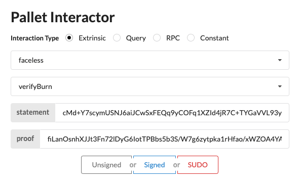

# Grants Program: Faceless

This repository contains code and resources for the [Faceless](https://github.com/HeisenbergLin22/Grants-Program/blob/master/faceless.md) program.

## All Steps to Build and Start the Faceless Substrate Node
### Macos
```bash
# Install homebrew
/bin/bash -c "$(curl -fsSL https://raw.githubusercontent.com/Homebrew/install/master/install.sh)"
brew --version

brew update
brew install openssl
brew install cmake clang

# Install rust
curl --proto '=https' --tlsv1.2 -sSf https://sh.rustup.rs | sh
source "$HOME/.cargo/env"
rustup default stable
rustup update
rustup update nightly
rustup target add wasm32-unknown-unknown --toolchain nightly
rustup target add wasm32-unknown-unknown

# Build faceless substrate node
cd faceless-substrate-node
cargo build --release

# Run the node
./target/release/faceless-node --dev --ws-external
```

## Crypto Implementation

### Anonymous Identity-Based Encryption

An implementation of a variant of the following scheme:

- Dan Boneh and Matthew K. Franklin. Identity-based encryption from the weil

pairing. SIAM J. Comput., 32(3):586–615, 2003.

Implemented [here](./aibe/src/bf_ibe.rs).


### BN254 Curve (alt_bn128)

An implementation of the `alt_bn128` curve that is almost the same as the [zeropool-bn](https://github.com/zeropoolnetwork/bn.git)  repository, but with some fixes to be applicable in our faceless protocol.


### BulletProof

An implementation of the [BulletProof](https://eprint.iacr.org/2017/1066.pdf) zero-knowledge protocol based on BN254 curve.


## Substrate Implementation

- A subtrate node in [faceless-substrate-node](./faceless-substrate-node)

- A web front end in [faceless-front-end](./faceless-front-end)
  
  

## Build and Run Instruction

### Environment setup

```sh
# Install Rust
curl --tlsv1.2 https://sh.rustup.rs -sSf | sh
```

### Unit tests

```sh
# Test the anonymous identity-based encryption
cd aibe
cargo test test_bf_ibe -- --show-output

# Test the burn proof generation and verification 
cd aibe
cargo test test_zk_burn -- --show-output

# Test the transfer proof generation and verification
cargo test test_zk_transfer -- --show-output
```

## Docker

If you prefer to run in a Docker environment, first install [Docker](https://docs.docker.com/engine/install/) before moving on.

### Build docker image

```sh
docker build -t faceless .
```

### Start a docker container

```sh
docker run -it faceless /bin/bash
```

### Run tests

Inside the container, we can try the following tests:

```sh
# Test the anonymous identity-based encryption
cd aibe
cargo test test_bf_ibe -- --show-output

# Test the burn proof generation and verification 
cd aibe
cargo test test_zk_burn -- --show-output

# Test the transfer proof generation and verification
cargo test test_zk_transfer -- --show-output
```

## Benchmark

We give a benchmark of the implemented identity-based encryption scheme below. Experiments are performed on a Macbook Pro with 2.5 GHz Dual-Core Intel Core i7. All tests are run in a single thread. We run the experiments for vectors of length 1, 5, 10, and 20.

| AIBE    | Time      |
| ------- | --------- |
| Keygen  | 6.35 ms   |
| Extract | 51.82 ms  |
| Encrypt | 236.25 ms |
| Decrypt | 185.11 ms |


## Tutorial

You can find usage of all public modules in `tests/`. We give further guides here.

### Zero Knowledge Proof Generation and Verification

We provide generation of zero knowledge proof of `burn` and `transfer` operations.  The burn and transfer proof generation can be found in `aibe/src/bin/burn_example.rs` and `aibe/src/bin/transfer_example.rs`.

#### Burn/Transfer Proof Generation

```shell
cd aibe
cargo run --bin burn_example
```

Suppose it outputs a burn proof and statement:

```
Burn proof:
fiLanOsnhXJJt3Fn72lDyG6IotTPBbs5b3S/W7g6zytpka1rHfao/xWZOA4YA2Y4UCJxbhehIaIG9SGe17NGCYctkayIkb4GXhW+CP3NkVea9BI2A8/izOggGVykl5IhLhhO1gNTgLfrruKol6OLTONymVWVUIwIO83zcjXmog8ggjF3j8yAJ4aJhrhn5B2kMnWP7W9MoG2F7ogk2qbaAw+CtiDIUD5mFIv7Lh0f+YnjlSWAfc5a5wTRwwTeWXIE8aoM+yXX0D/b/S1Bn95LtwHp31Ttmlbv6SBMIrTjxQJyYo6A9c8BzQ46kWw+QAwA9AhKH+29C0Fw1tbqmmVxCTB43/4Zk+3pNUqFxE/R0gii2rTzxUvg+kdlQ4YtZ8Eik6ZXrOwAQRVYIBhAgJE4tyvXakCKnUqCk3MM5rM1rRvr5KgM2pB2yHYaRFzuvjqBE8ndrmkPPVDJUmE6VHSILg==
Burn statement:
cMd+Y7scymUSNJ6aiJCwSxFEQq9yCOFq1XZId4jR7C+TYGaVVL93ylyK6xH7cCGYcX0ZA6HUrzDPvTI+U0ZJAkMP/EGzL175WTUf2iuo0jc2gw3jNwzliZWmytIQCDIZiyBAa8pS1E9N2SuBgwOUDXt+7eo+3DCvWI5hW+9jQQCZOjDmxJKuTZaoVo9eCMiXxihtQBOzElt3rQ35cO4pAe8SQKNaJRHfRv9xMXXgpDZ6vu3DjmCx2u2uhlvr3kcOjyagQ5w3fNoqsWxO8tpZkrF2Q2DO7rLOsZuSPunuqyjSa3I2Sb42WyLtG34laLGUmPb2rELNZmUaxYARXwKpG5Vgdx56guZ0EXec1RMEN98nMwQZ49sEOUJv4H816OsRNAHlCdNuiMil0i03wP4vPLfw5ytHIjw6+/5uCUlNSgJ57kjxM38ncsT15qosm3xJiQK1nZQlRZrLMfbzw19qHuq4g5Db+yCIr6WGyWmmHlNAguERoZ6S3yP0hbETOtIqVKatFiI60zlzySRuz0xvJ+1yCervsnZScvHDgeiK8xzswO8UhSuGZYVKsDJITijwfNDjN3Uq1oTC8+osaBqALQMQMP0f+TNoo9qovnng2toRh7SeksaFBQFdVI1HBLkjea9lS6Y2cqqbxzbaO7rKE4Szf90NCZ42e2RExmWm9hU=
```

For the transfer proof, run:

```
cargo run --bin transfer_example
```

This would output a transfer proof and statement like:

```
Transfer proof:
TlMcjubogCNj0dfdzJYhqBdHB9+jfs5DsW0i3sqPQCygoq1hIofwRx2rFzu8QBMyqwRohzTMhKBKoabxhApeKNlCggZUrZqiOMBocSkk4SSevZoiGdEHdq+7P2M+eCAnqY8p9i2RxB9RhkpCUi/UarLvbqvHuSdpwbWL/+Dd7y+872YWHkpyjrLn+deUypvdZ987GOly0TSjy+h1E8SjKZlT0FVE/oiF9VylYt735OzYlIwDEoZhgBzkhpgnDugakzoQ0sBqIA4WPSId/a6GG6ybinU7KoCLyGT3fbVqJw2gwimVxMS5bT8g2sZWQ41plaviQ15ncQ85MuthrVfDCWlMQTIDeYO14ujVOk0hY2ToJROv1qduE92ZcA2ak5oGHZxYbZUo0lH89XX84zvUnBgZr1lqK1Yml7B+bLyylibOL6uTzfJwyEwCWzL4SaRIEVvks5pp+kmBj7F1VgpaCL1ks/tTnsxaid9LYUcVPu2kNV6pi3PIiWbFPGa9afQA0yqazgAdFARWjM54q2MtACUXK0D0xbG6FkIztf0Xqh8+wJj6QcLhNCbpcCYdgUw1SbwIJw0ZLi6Kf4zzpRPWC3PWqxGOPsgolxAR7ynYf6h7fmObtCSU24gTDW/Zs0QK0Z5W9XxgYTjFN4KReCr50FxdAVxhs6Oix8aWE0HDYQeYqNGAXeuZChLlyHzjm415BnBo/xQM6V32ecvNZGJ3LUrDaJX1RPFKqUf2esY6XAwP4FKZkKLvpIcjpdhcVLkm08Pze83rqIhlMEXZoVkVs1lJK1LDFkhjJM3ziyocuxr6S90w3FCZup3KUBQFKIBgGqgEBVMV/z4jfVOUE6mbEdgqCXmI/7vGvdNkXN5PiiCaqdprauEm03f3xmY7X+cApEbRfm4PDANbpoYy3Sd4VWcejp+Aaj/wXk/VuuqwVwPwfSwDWJVFmqKQYXR9v3e5iJQ5rff9V6fmXGJRdJMLMGRIoaa63JMfn6eTxwigJYcyYE7JQpfMHTZHBg7RYH4OdQp+qFZQqgIqTqwCd2KN9ApRZ7IneRUfoGmptqO2GB/wOVVVeOnsw50U1gh4yQjn5mFZeZ8AIsnV8n+xDB1bAPGDSVqvqyGlmZaon7SQIZaIDtuRlWGwcQ41rvPufbQW
Transfer statement:
lQBscyI0S1M8IJ4n8uxXocHIt5CZ6VejQmyX1dRl2whepK8z97MHb1g3dQ+g/Tls7Q2JXGEPz0j0mPxa1hT2D1KOkNF1SdGHbnmPNZpeziyGeJkWYZ1AbSNHsaZmrlIhcfYXpL/ADOW899wzTXAn0tcgQXJxZYqpCYNjp3rexyUwHXMf2wHlNeUTmy66TygkufokipAYs3fZv72WRSSRBHmGN4qI7U6yfRByFks8j8RNhAdUzcyh0BnLUhPITmQbioPBP3sDcQzwrIZT/jWgH+o+getnQWJL8Yw/dvTpiRWEhSma1ByqnSFW65wP3ZFX6nLd+aTRa0wAweU0KHDlCSiHIW4RBVqbF/TIkYdXL4qGhGML0jFWSjAmrUwe7z0FzigKbEVa5o9wxytN3JO71lzFQINwNffcCmMc3XM6GxykGrPxyBbXgFOjCpIt+YyJ378Jocf8VX3jN47gaXcGA+OtU5pZZqeGN9muZ2M1wYkG4V7E8NhPV+k6ubfoqM0Hyo12Ep5Iw/LeNnsuou2SBiqZBIt6odvB+82ThsB9hiAHLRBxLsb24w0UhM2fV500dwJt0gt98sX7mHkE5u58FRo3xWGo+Ef2xUazsPzkrDwzYohV/N1P7SptMa54Ze8ujgZP5STCVjx6htDxweT3ANW7cmkgRTNbBAq6xX0xCBvNz45G59+ul2CkIHiBQdNtMOPGU5RnP4QuCiUtc6rlIr8tpJyA+OPLnR2pb/qKu6MKp4ghPu8GmWkc8NIgvhkmdrXqluD88w9bqHsJGlfSRw09tWm1E+Eu6Obj7CopTgjXhnV4Gto+hmH5W4QNp0cEfiANLcps5PB6BK0b/ptCJtPg63bp7UOqtp+1sADfpPHPVrXUoTDynogetUQbeakBFi6Tf6k9z73coZuVB2Qz9WY73p7rzpqTyM/Ti+qXSCOsyc1waM2eP4TK1REOaZXJYEiJ4gWctPa6/TMiAMVjKI+xPDu/yj6rdTWcK0RO1nthIijVv19fdtrgE+DgnwQB3qfZzJv2mTyncqqGlXoP8s2lrVRmTdIryeZYS6IGLg8IfNfRCVPmYNWm3aw1uUMUvl6Wz6arE19wTpO4PtbOJaR5fexoFaCsSi2vr+sn1xYbB1ICIbaDPj9C7//TTjsdnHOMJctpDWGX7aHfm/DqAOiuhW8NNJ9unnYZsnxhlytZIt+DfBG/p3tQpDkJ7hDwJaK9hm/JlyRI60a5qTDkKiCeVDC6aul9bNqRJQ0lu/1aYv2GcONE0sj2H6YQ+7EUrFCKBgY+4CzepciwoqsQnqFVcb29mccSM/TNZxKlMwx3/1V9DWhjdEnhlimuHMD48HSBENAsXyPoYrDlW21wGWcHLZ45c/FATX6ya2cglzJ60j1Pu0asWa9zjb7QrvwNGZrXHucoPVC40dgP5rgbzfimEfxuII9GUT7xQJlzDx2KJvw8vUCQgnGPzy4/gaXmcbbNQL83azrd4VV6My6PIxJdpCUBbEee5BbKNmpzTDIUA+29H74RL9/XMHIJPfsi62/sKvWw0I/xk7PI2zf1lj7cbYgzzs0dfy80U60ANyC+gYOM3qmzvfFXa7TjMoK+caU00ONLBlJjmqHwv65uGebpAS/8MBjjBZnfHbLRgaVXzPZgJl0svCC6ROgYPRMl6+BK7neRdMM//9+F+X8Q9+NEoC50qPLOwwvW7oIHjCR20+q3zre9KeVlm5ohepfkV4UamdNsmgRn1XcqkkApLV2lWwSg39lXI0gB04ngf6UNq78IxtNeybwens9U6MkbMM4sn38k/or4GEeFXZZq/Gg0xMQk/y9hCc7gMbLBeBYH5Fvsy5jB9/QXR6HtzhqKF5FNRcK7RmcZ5p20ntnlGw48YGtlzaPP5ymCo6zNXzDkJlYntYAspzrUpJfgxDIExhS2ZwX7P65j4C/OQ7YggADxXP53FMZ5HHMJ9puLmCkYyLvq0zK5tkU+NBtZ/5I+4r/axspOpwjcrvmyO/OgFOP9YqsespLu0zj6b6tBXLc84Dp0+nhgJXMjIT4UQbsRKXYzKx5O5HUDrg4ANw9l4J2bkjH3kJKTNCp14KO8RyJX3Zq4i+1Ge9k4ZBpRmNdoAaW8t49qNhWaayrAqYH4Ew==
```


#### Use Substrate to Verify ZK Proof

After generating the ZK proof, we can use a substrate pallet to verify it. To setup the environment, run:

```shell
# Build and run a substrate node
cd faceless-substrate-node
cargo build --release
./target/release/faceless-node --dev

# Open another terminal, annd run
cd faceless-front-end
yarn install
yarn start
```

This should open a web page in the browser: http://localhost:8000

On the web page, we select "Pallet Interator --> Extrinsic --> faceless --> verifyBurn", then copy the above burn statement and proof to the corresponding input boxes, like the following image, and then click "Signed":



We should see corresponding events that say the burn proof verification is successful.

## Documentation

Run the following to generate documentation for the anonymous identity-based encryption in `aibe/target/doc/aibe/`:

```shell
cd aibe
cargo doc --no-deps
```

## Security Warnings

As of now, this project serves mainly proof-of-concepts, benchmarking and evaluation purpose and not for production use. Also implementation have not been fully-reviewed.
